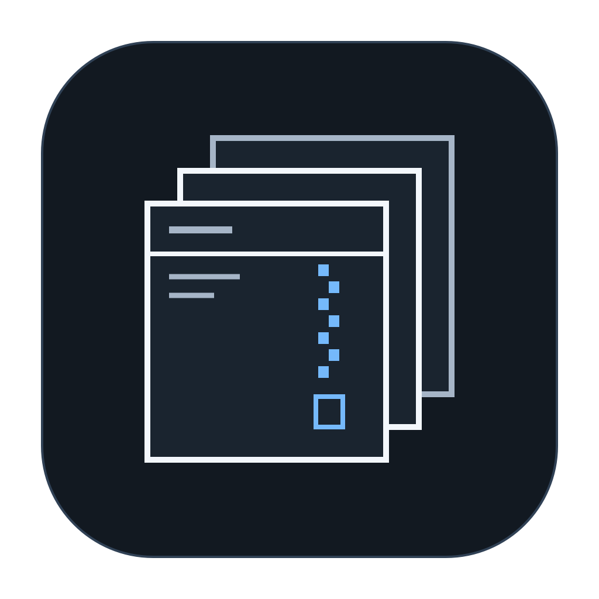

<h1> Kkuk</h1>

**Press down. Pack smaller.**

A macOS app for compressing a file or folder into a 7z archive. Kkuk automatically chooses a high-compression preset based on input size and available memory—no settings needed.

[한국어 설명서](README.ko.md)

## Getting started

Open `Kkuk.app` on an Apple Silicon Mac running macOS 26 or later. No separate 7-Zip installation is needed. The app supports English and Korean, following your macOS language preference.

1. Drop a file or folder into the window, or click to choose one.
2. Select **Compress**.
3. When finished, select **Show in Finder**.

You can also right-click a single file or folder in Finder and choose **Compress with Kkuk** to start compression immediately in a compact progress window.

## How it works

- Prioritizes compression ratio; some inputs may take longer or barely shrink.
- Verifies the archive and checks for source changes before finalizing it.

Compression only: extraction, encryption, and split archives are not supported.

## 7-Zip license

Kkuk bundles 7-Zip 26.03 by Igor Pavlov. [License texts](Kkuk/Resources/Licenses/) are included in the app. See the [engine notice](Kkuk/Resources/Licenses/NOTICE.md) for details.
